# Flujo de trabajo en GitHub

> **🔖 Nota:** Es importante clonar el repositorio y instalar las dependencias del proyecto ya que nos facilitara la creacion de un commando que utilizaremos mas adelante.

Actualmente el flujo de trabajo que podemos llevar **GitHub** va mas haya de simples **commits y PullRequest** ya que podemos dar un seguimiento muy robusto sobre todos los cambios que se generan en el dia a dia, por ejemplo podemos hacer.

## Issues
Es una unidad de trabajo que es designada para realizar una mejora dentro del applicativo que se este desarrollando. Un issue puede ser el arreglo de un fallo, una característica pedida, una tarea, una solicitud de Documentación en específico y todo tipo de solicitud al equipo de desarrollo. 

Con los issues se puede asignar una tarea a un o mas colaboradores del equipo, lo cual permite tener una mejor organización en proyectos. Los issues tienen etiquetas, con las cuales se permite realizar una busqueda filtrada  ademas de que permiten entender las idea principla de la tarea, dichos issues pueden ser asignados a proyects los cuales nos permitirian identificar la ide global de las tareas asignada.

## Millestones

Estas son categorías que se utilizan en las issues para tener un filtro más adecuado de la información. Cada milestone puede tener una fecha programada indicando el tiempo que es necesario para cumplir ciertas tareas. Puede ver que si la issue es una pregunta, cuantas issues son necesarias para completar la milestone, el porcentaje que se lleva de la milestone , cuanto tiempo falta para que expire, si  se requiere programar o investigar algo, etc. Desde ese momento tenga la idea antes de abrir el issue.

## Proyectos

Estos nos sirven para tener un filtrado de pulls y issues ya que nos muestra una vista consentrada de todo esto. 

## Reto 1

Tomando en cuenta los conceptos explicados anteriormente vamos a ver como podemos hacer que todo esto trabaje en nuestro beneficio.

### Generemos un issue

Para poder crearlo hay que seleccionar la opción **issue** que se encuentra en el listade opciones despues seleccionaremos la opción **new issue**

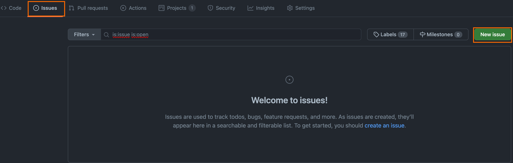

Lo cual nos mostrara una ventana donde se listaran los templates de los issues o nos datra la opcion de crear un tmeplate en blanco

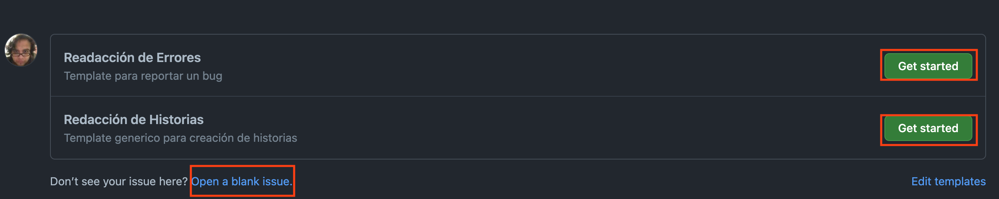

Podemos seleccionar cual quier template o crear un issue en blanco porcederemoos a crear nuestro template, es recomendable relacionarlo con 

- labels
- millestone 
- proyecto
- asignarlo a nuestro usuario

Al hacer todo esto nuestro issue se veria de la siguiente manera 

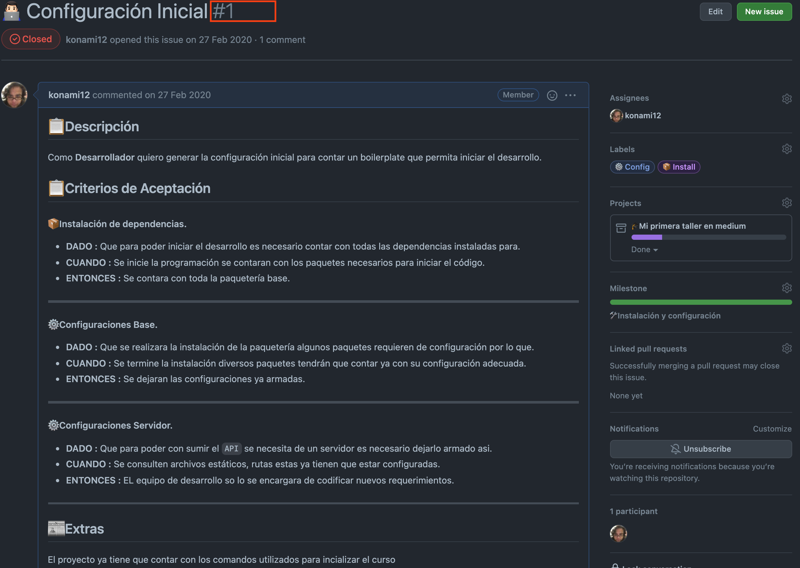

Como podemos ver nuestro issue nos genera un identificador el cual utilizaremos para relacionar los **commits** que generemos para resolver nuestra tarea.

> 📝 Nota: Si todo salio correcto podremos consultar las siguientes ligas.
> 
> - Proyecto: https://github.com/OrcaPracticas/flujo-github/projects/
> - Millestones: https://github.com/OrcaPracticas/flujo-github/milestone/1 

## Reto 2

Es momento de resolver nuestro **issue** y relacionar nuestros **commits** con nuestro issue.

Es importarnte saber que los commits los generaremos utilizando conventional commits, si te interesa el tema pudes consultarlo en esta liga [Guia para conventional commits](./CONVENTIONAL_COMMIT.md)

> **🔖 Nota:** para seguir con los retos es importante saber que tenemos claro el uso de conventional commits.

tomando lo anterior en cuenta procederemos primero a crear una rama en la cual podremos trabajar, para despues subir los commits correspondiente que den solucion a nuestro issue, por lo que procederemos a realizar commits (puedes subir lo que tu necesites)

- Generaremos una carpeta o archivo
- Al contar con los cambios ejecutaremos el commando git add -A
- Para realizar el commit utilizaremos git-cz(commando creado al instalar las dependecias), al correr el comando veremjos algo como esto.
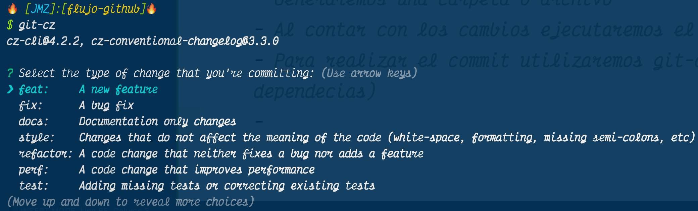

en el cual nos facilitara un listado de los tipos de commit que podemos generar ademas de ffacilitarnos un listado de pasos que nos guiara para la creacion de dicho commit, 

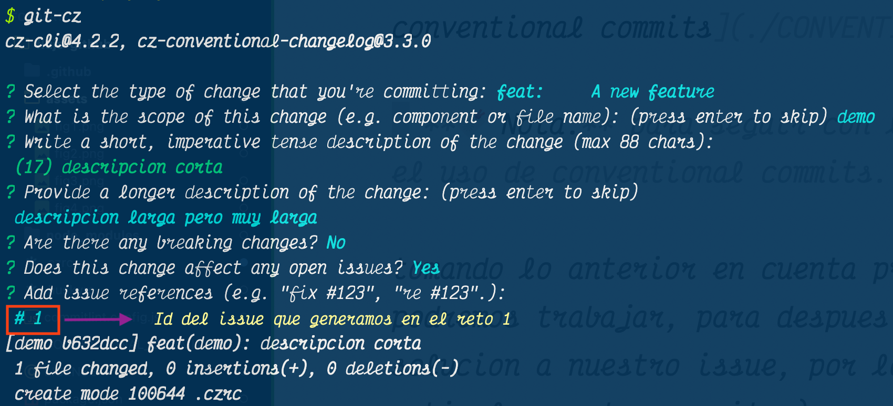

si todo salio correcto podremos ver algo como esto

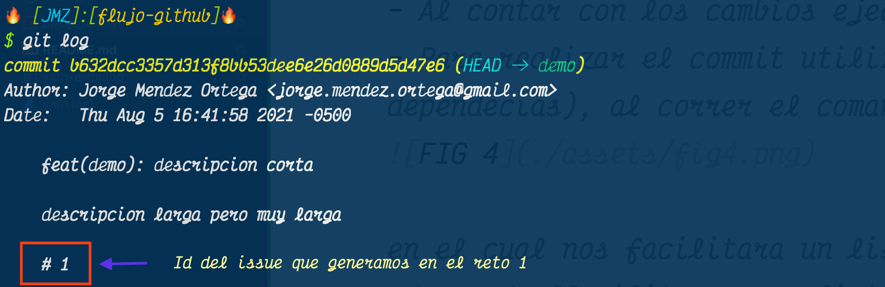

> **🔖 Nota:** en el apartado donde pone #[numero] hace referencia al id del issue que generamos de esta manera nuestro commit se relaciona con nuestro issue. siempre se tiene que poner el #.

Al termino de todo esto podremos realizar nuestro **git push** y si nos dirigimos a revisar el issue que generamos veremos algo como esto 

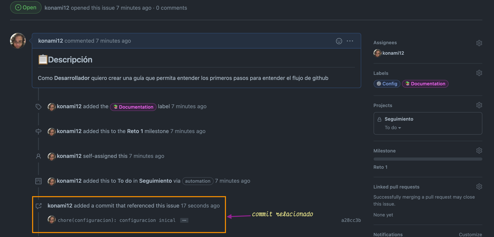

nuestro commit esta relacionado al issue :).

## Reto 4

Por ultimo procederemos a relaizar nuestro **pull request** para cerrar nuestro issue y ralcionar el pull contodo el flujo creado.

Solicitaremos que nuestros cambios suban a la rama master pero en este caso en esecial editareos nuestro pull de la siguiente manera.

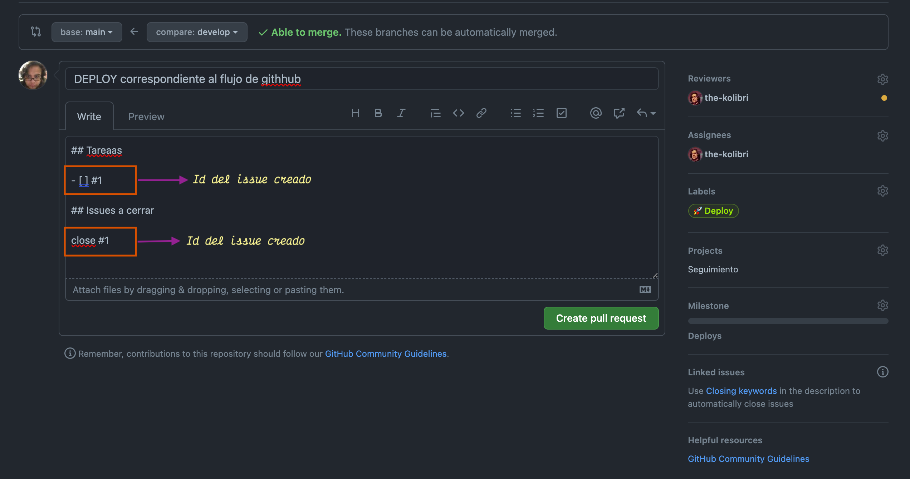

en este caso solo vasta con poner el ide del issue para que al momento de crear el pull veremo algo como esto.

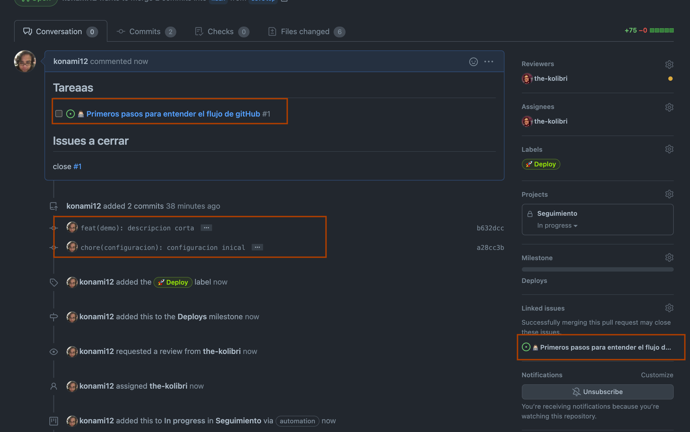

Existo logramos seguir el flujo de github, hey un momento y que paso con nuestro project?, facil este lleva el registro de los pasos que estamos siguiendo por ejemplo al momento de generar el pull nuestro poryecto muestra esto 

cuando se esta en proceso de revición se muestra

cuando se genera la revicion y todo esta Ok podemos ver lo siguiente

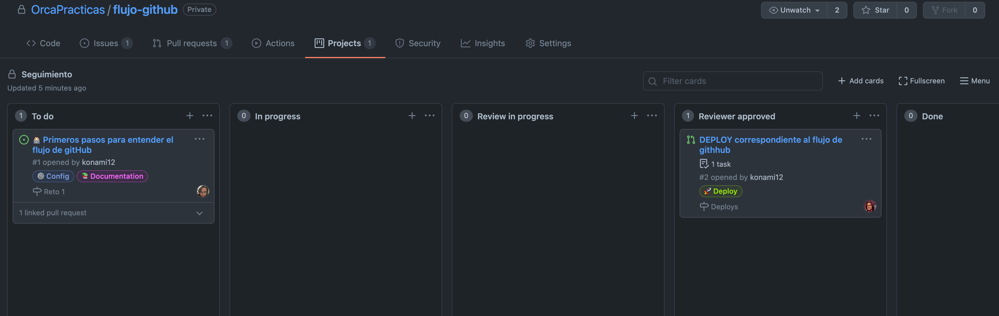

Cuando se realiza el pull se muestra lo siguiente.

como podemos ver marcamos el check para indicar que se genero la revicion y podemos ver que el iconito correspondiente al issue cambio de color, pero que paso en el proyecto?

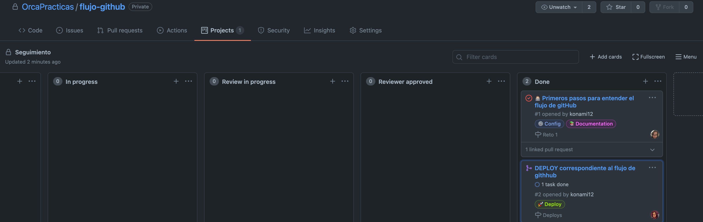

como podemos ver se modifico el status del pull y del issue hora teneos un flujo completo de trabajo podemos revisar todo el historial desde el issue que generamos.

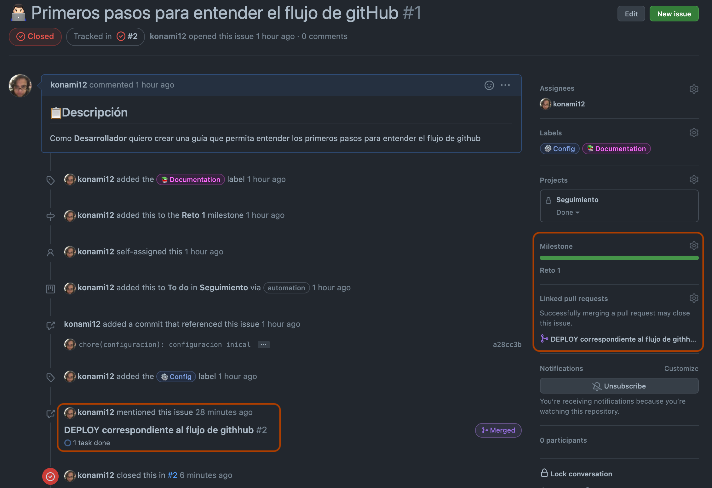

Pdemos ver todo el historial de cambios realizados.

